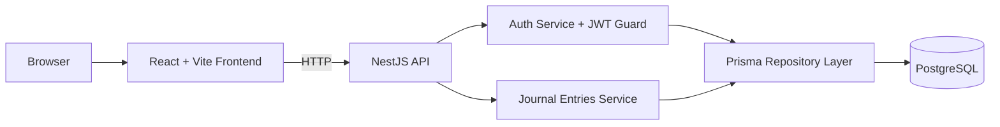

# Architecture Notes

Mind Shelter intentionally uses a small, explainable architecture:

- one React frontend
- one NestJS backend
- one PostgreSQL database

This keeps the project easy to review, easy to modify live, and aligned with the assessment's emphasis on clarity over scale.

## Main Decisions

1. Monolithic backend, not microservices.
2. One primary business entity: `JournalEntry`.
3. `User` exists only to support authentication.
4. Public API surface stays small.
5. Infrastructure remains reproducible through Docker Compose and CI.

## Backend Structure

- `application/`: services, mappers, tokens
- `domain/`: entities and repository ports
- `infrastructure/`: Prisma, auth guard, persistence adapters
- `interface/http/`: controllers and DTOs

This follows the same general spirit as `luvao`, but in a much smaller monolith.

## Frontend Structure

- `features/auth`: authentication screen
- `features/journal`: journal editor and list
- `services/api.ts`: centralized API calls

The UI keeps routing and data flow simple so each screen remains easy to explain in an interview.

## Diagram

## Deployment Notes

`docker compose up --build` starts:

- PostgreSQL
- backend API on port `3001`
- frontend on port `8080`

The backend exposes `GET /health` and the frontend is served by Nginx with SPA fallback.
